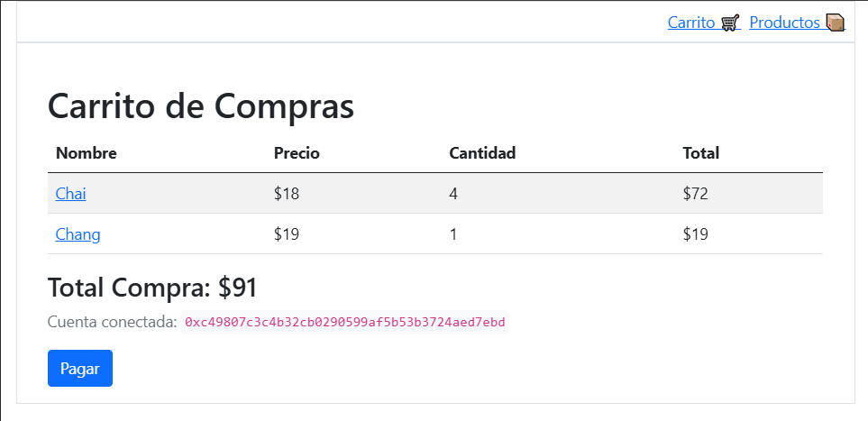
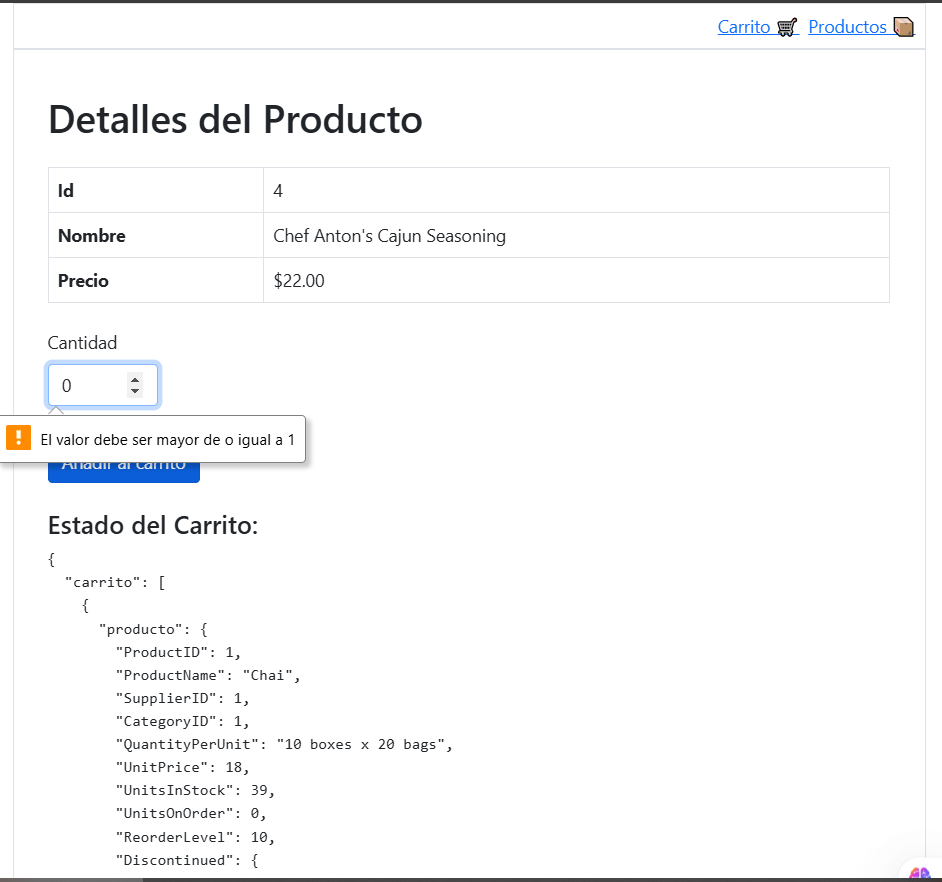
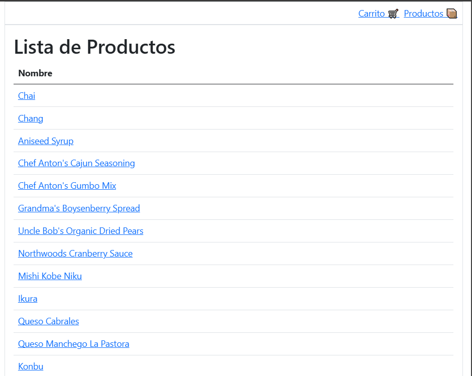
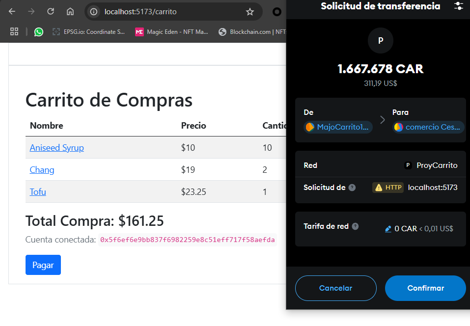
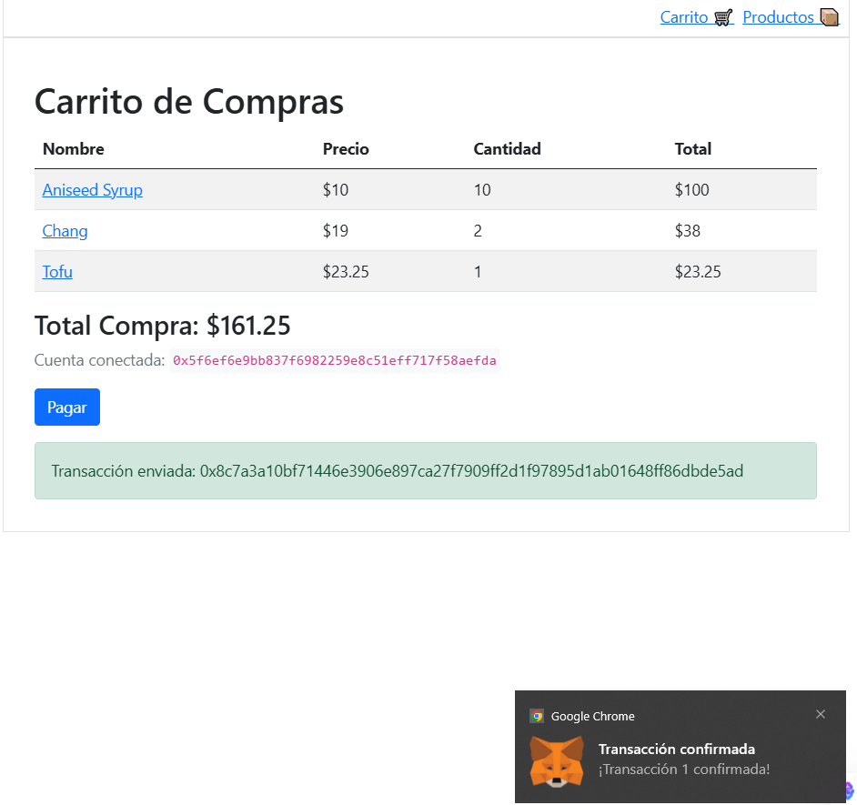

# Proyecto Carrito de compras ETH - Cesta ETH
Se presenta un proyecto de compras con los productos de la base de datos Northwind montada en Mysql en un contenedor de Docker.
Los pagos se pueden hacer desde Metamask.

## Pantallazos

A continuación se presentan algunas capturas de pantalla de la app:







# Instrucciones para levantar el nodo Ethereum en Docker

A continuación se describen los pasos necesarios para levantar un nodo Ethereum usando la imagen `ethereum/client-go:v1.13.15` en Docker. 

1️⃣ Crear una nueva cuenta en Geth usando la imagen ethereum/client-go:v1.13.15

```bash
docker run -v ./data:/data -v ./pwd.txt:/pwd.txt ethereum/client-go:v1.13.15 account new --datadir /data --password /pwd.txt
```

2️⃣ Inicializar la blockchain con un bloque génesis 
```bash
docker run -v ./genesis.json:/genesis.json -v ./data:/data ethereum/client-go:v1.13.15 init --datadir /data /genesis.json
```

3️⃣. Lanzar un nodo Geth en Docker
```bash
docker run -d -v ./pwd.txt:/pwd.txt -v ./data:/data -p 5557:8545 --name proy_carrito ethereum/client-go:v1.13.15 --datadir /data --networkid 88889 --unlock 0xbb6f45d2684e43dfa68ec1490cf0c50a41073715 --ipcdisable --allow-insecure-unlock --mine --miner.etherbase 0xbb6f45d2684e43dfa68ec1490cf0c50a41073715 --password /pwd.txt --nodiscover --http --http.addr "0.0.0.0" --http.api "admin,eth,debug,miner,net,txpool,personal,web3" --http.corsdomain "*"

```