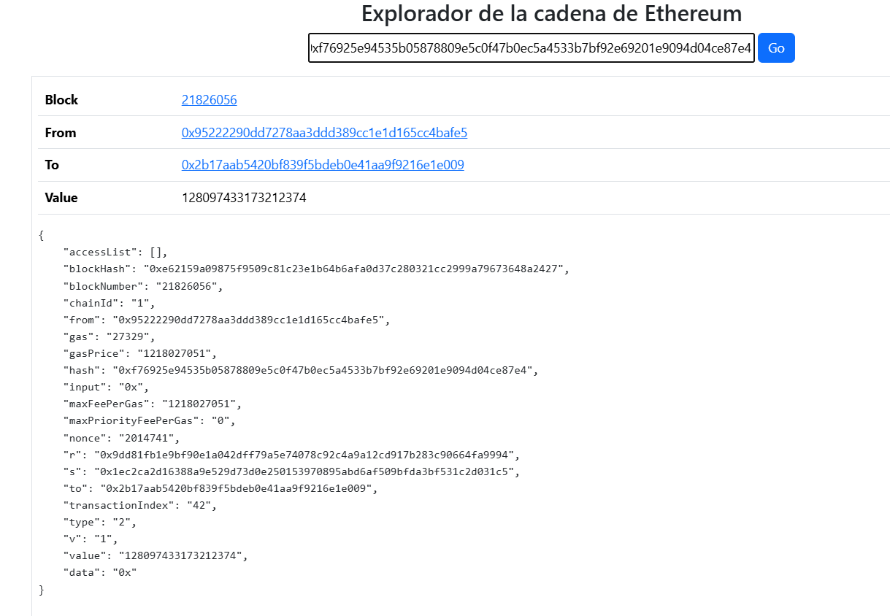
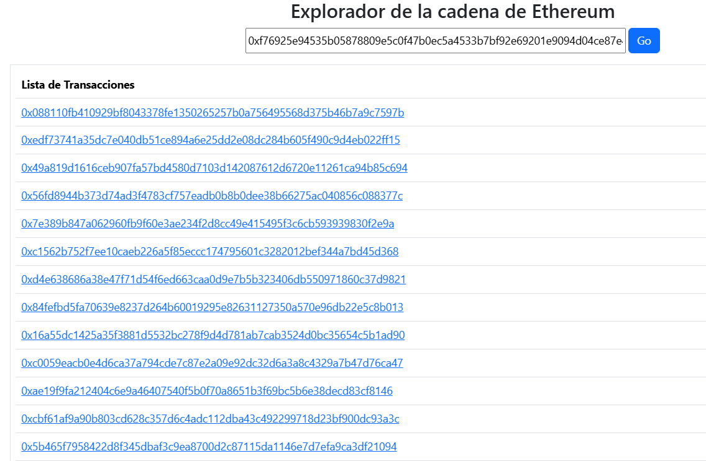
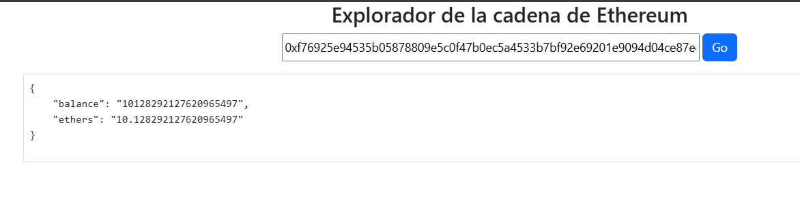

# Explorer Project

Proyecto de exploracion en la blockachian de Ethereum
 

## Obejtivos
- Explorar la cadena de bloques Ethereum
- Usar un provider externo (Infura en este caso)
- Usar el Api Web3 para acceder a la info
- Usar React para generar una interfaz amigable
- Realizar un Api Nodejs para interactuar con el provider 
- Programar el provider para consultar transacciones, bloques y saldps de cuentas

## Pantallazos

A continuación se presentan algunas capturas de pantalla de la interfaz del servicio:

