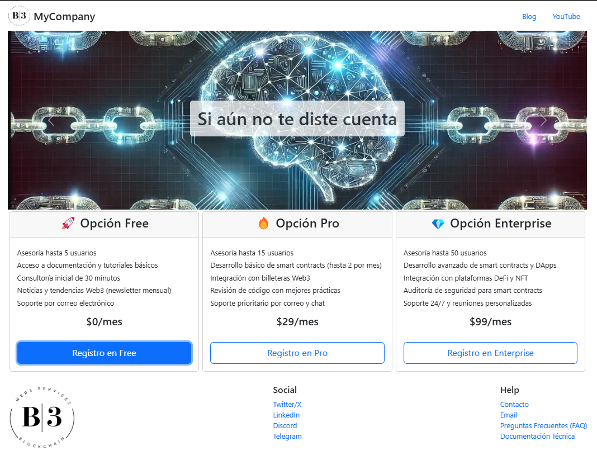
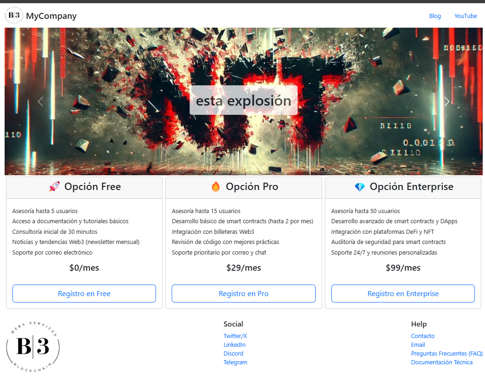
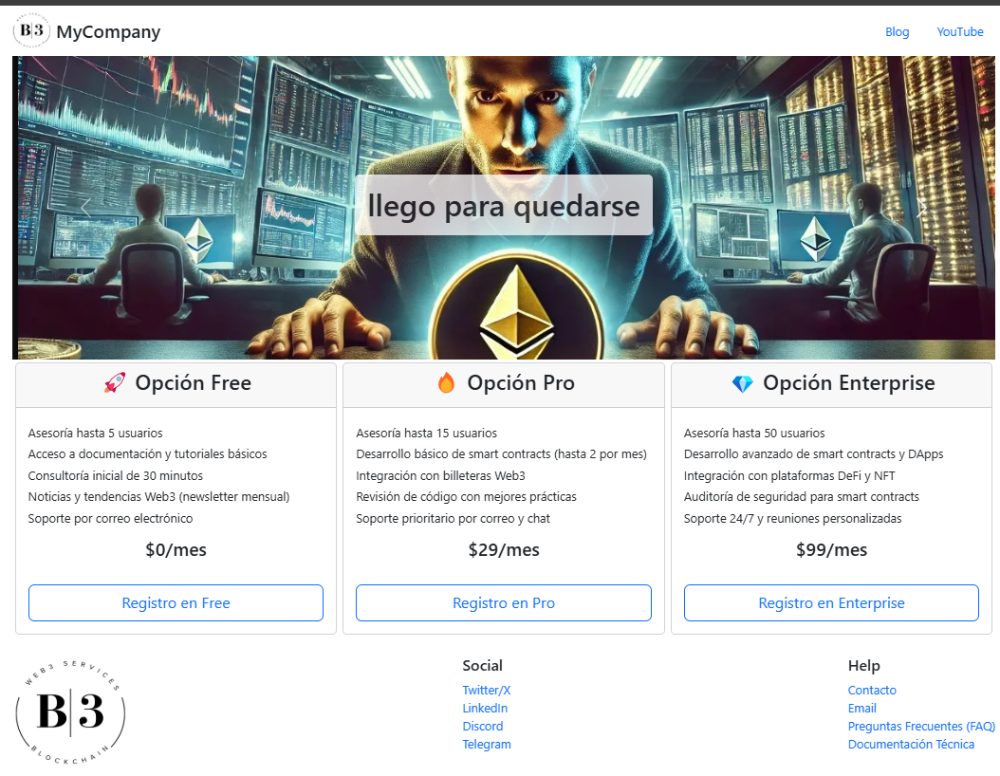

# React + Vite

Este proyecto es una aplicación estática desarrollada con React y Vite, diseñada para manejar componentes de manera eficiente y con una configuración mínima.

## Características

- ⚡ Configuración rápida con Vite
- 🔥 Hot Module Replacement (HMR) para recarga en tiempo real
- ✅ Integración con ESLint para mejores prácticas de código
- 🏗️ Uso de componentes reutilizables en React

## Instalación y Configuración

Sigue estos pasos para instalar y ejecutar el proyecto en tu máquina local:

### 1️⃣ Clonar el repositorio
```sh
 git clone <URL_DEL_REPOSITORIO>
 cd nombre-del-proyecto
```

### 2️⃣ Instalar dependencias
```sh
npm install
```

### 3️⃣ Ejecutar en modo desarrollo
```sh
npm run dev
```

### 4️⃣ Construir para producción
```sh
npm run build
```

## Plugins Oficiales

Actualmente, este proyecto soporta los siguientes plugins de Vite para React:

- [@vitejs/plugin-react](https://github.com/vitejs/vite-plugin-react/blob/main/packages/plugin-react/README.md): Utiliza [Babel](https://babeljs.io/) para Fast Refresh.
- [@vitejs/plugin-react-swc](https://github.com/vitejs/vite-plugin-react-swc): Usa [SWC](https://swc.rs/) para Fast Refresh con mejor rendimiento.

## Capturas de Pantalla

A continuación, se presentan algunas imágenes de la aplicación:

   
   
   
