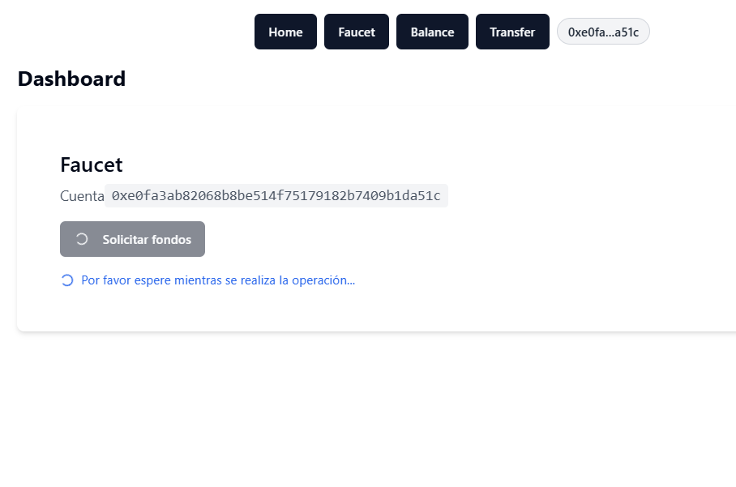
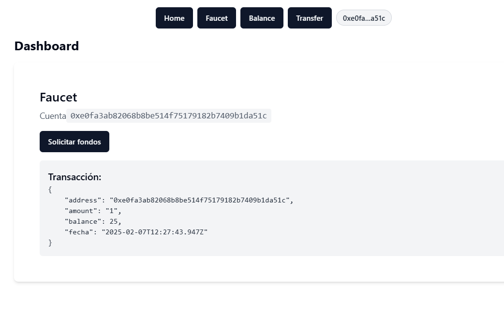
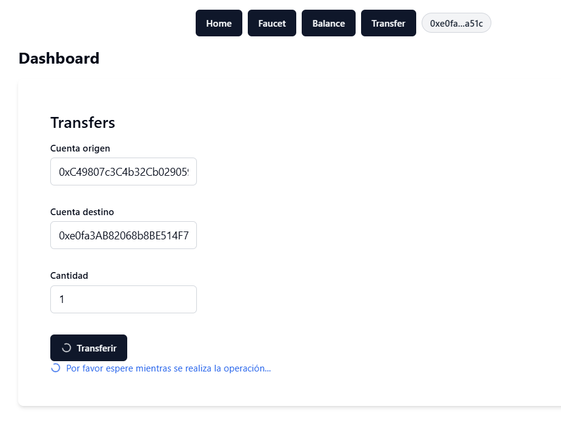
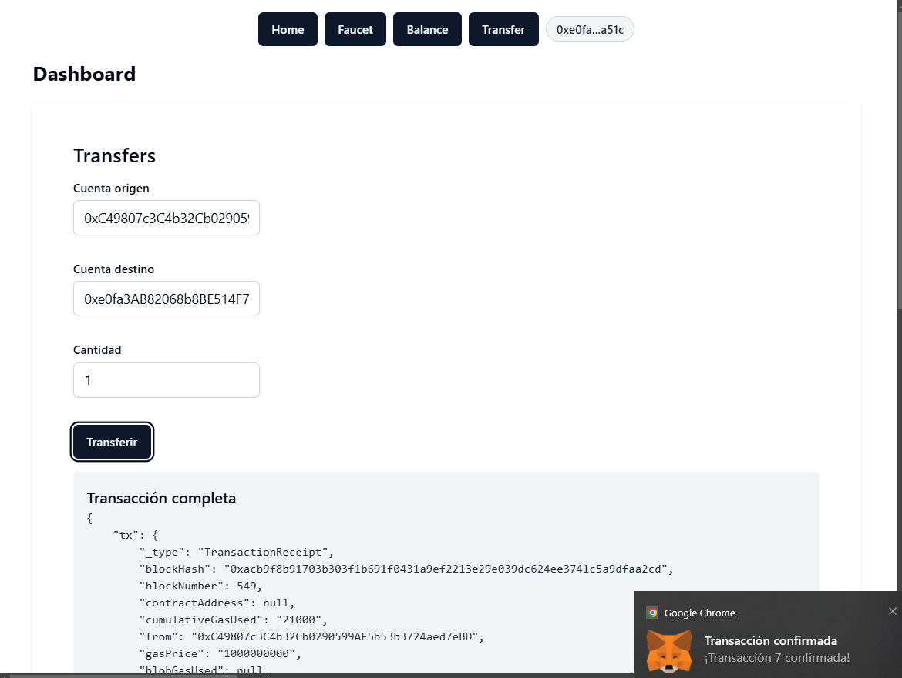

# Faucet Service

Este es un servicio que permite a los usuarios interactuar con una faucet a través de su cuenta MetaMask. Los usuarios pueden solicitar fondos, revisar su balance y hacer transferencias de una cuenta a otra.

## Definición del problema

El objetivo de este proyecto es proporcionar un servicio de faucet que permita a los usuarios obtener fondos, verificar su balance y realizar transferencias entre cuentas mediante la integración con MetaMask.

## Pantallazos

A continuación se presentan algunas capturas de pantalla de la interfaz del servicio:






# Instrucciones para levantar el nodo Ethereum en Docker

A continuación se describen los pasos necesarios para levantar un nodo Ethereum usando la imagen `ethereum/client-go:v1.13.15` en Docker. 

## Pasos para levantar el nodo:

1️⃣ Crear una nueva cuenta en Geth usando la imagen ethereum/client-go:v1.13.15
```bash
docker run -v ./data:/data -v ./pwd.txt:/pwd.txt ethereum/client-go:v1.13.15 account new --datadir /data --password /pwd.txt
```
- ✅ Este comando crea una nueva cuenta de Ethereum en Geth.
- ✅ La clave privada de la cuenta se guarda en la carpeta persistente ./data en el host.
- ✅ Se usa el archivo pwd.txt para establecer la contraseña de la cuenta automáticamente, sin necesidad de ingresarla manualmente.

2️⃣ Inicializar la blockchain con un bloque génesis usando PoA
```bash
docker run -v ./genesis.json:/genesis.json -v ./data:/data ethereum/client-go:v1.13.15 init --datadir /data /genesis.json
```
- ✅ Inicializa un nodo de Ethereum con un bloque génesis personalizado (genesis.json).
- ✅ Almacena los datos en la carpeta ./data en el host, asegurando persistencia.
- ✅ Obligatorio en redes privadas, ya que define los parámetros iniciales de la blockchain.


3. Lanzar un nodo Geth en Docker
```bash
docker run -d -v ./pwd.txt:/pwd.txt -v ./data:/data -p 5556:8545 --name nodo_eth ethereum/client-go:v1.13.15 --datadir /data --networkid 281910 --unlock 0x3bd825a18628004b2ccd3c4f23b8ba0fe880753f --ipcdisable --allow-insecure-unlock --mine --miner.etherbase 0x3bd825a18628004b2ccd3c4f23b8ba0fe880753f --password /pwd.txt --nodiscover --http --http.addr "0.0.0.0" --http.api "admin,eth,debug,miner,net,txpool,personal,web3" --http.corsdomain "*"
```
- ✅ Guarda la blockchain en una carpeta persistente (./data).
- ✅ Expone el puerto 8545 en el host en el puerto 5556 (para JSON-RPC).
- ✅ Se conecta a una red privada con ID 281910.
- ✅ Desbloquea una cuenta para transacciones y minería.
- ✅ Habilita la API JSON-RPC para que se pueda interactuar con el nodo desde aplicaciones externas.
- ⚠️ Usa opciones potencialmente inseguras (--allow-insecure-unlock, --http.corsdomain "*") usadas para este caso de prueba.


