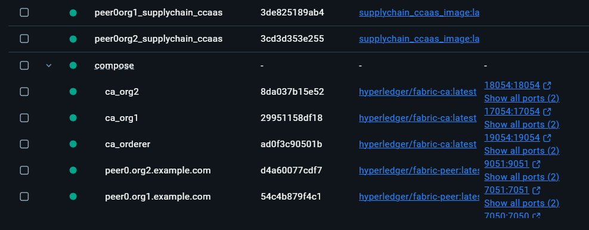
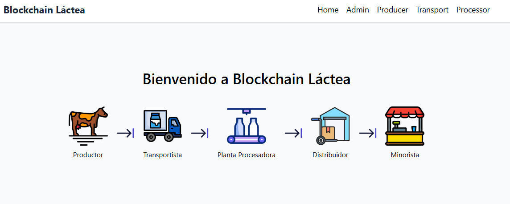
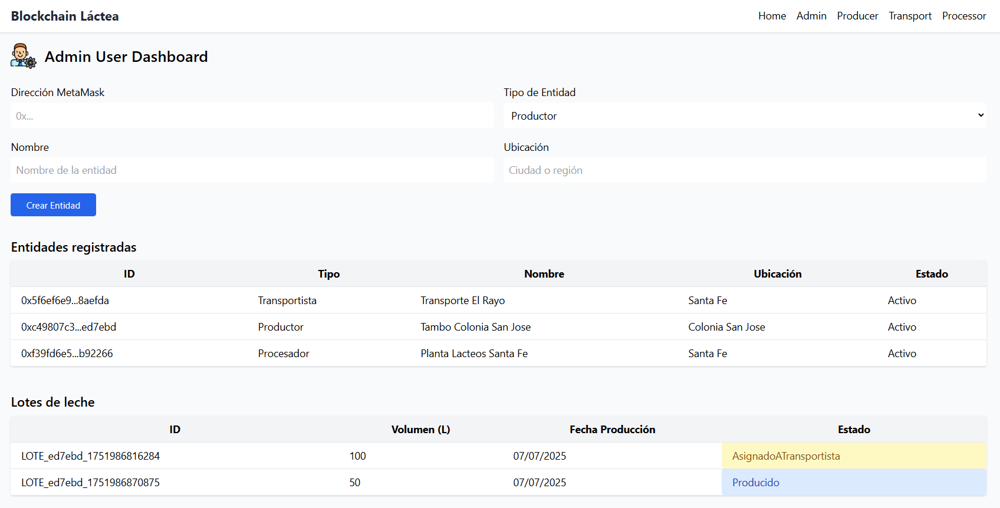
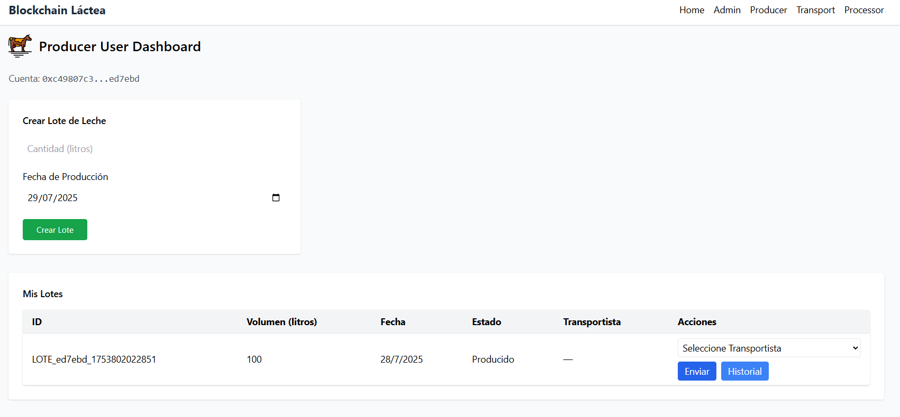
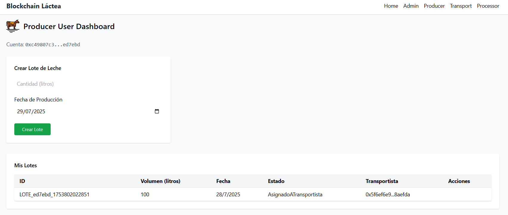
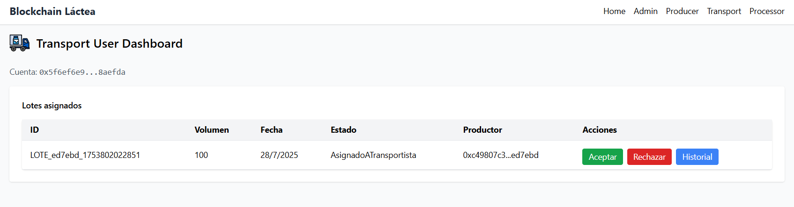

# 🧀 Blockchain Láctea - Proyecto de Trazabilidad con Hyperledger Fabric

El proyecto implementa una cadena de suministro láctea basada en Hyperledger Fabric mediante el enfoque Chaincode-as-a-Service (CCAAS).
Permite registrar entidades clave del ecosistema: productores, transportistas y plantas procesadoras, con posibilidad de incorporar nuevos participantes en futuras fases.
El objetivo principal es asegurar la trazabilidad de los lotes de leche desde su origen en el tambo hasta su recepción en planta, extendiéndose posteriormente a etapas posteriores de la cadena.

## 📂 Estructura Relevante del Proyecto

```bash
.
├── chaincode/               # Contratos inteligentes TypeScript para cada entidad
│   ├── src/
│   └── runChaincodeSupplyChain.sh
├── fabric-samples/          # Red de prueba Hyperledger (test-network)
│   └── test-network
│       └── network.sh
├── api/                     # Backend Node.js para interactuar con Fabric
│   ├── app.js
│   ├── fabricConnection.cjs
│   ├── gateway.js
│   ├── enrollCAAdmin.cjs
│   ├── importAdmin.cjs
│   └── wallet/              # Almacén de identidades X.509
└── web/                     # Interfaz web con Next.js
```

# ⚙️ Pasos para ejecutar el sistema 

## 1️⃣ Levantar la red Fabric con channel
Desde la carpeta fabric-samples/test-network:
```
./network.sh down && docker ps -a && ./network.sh up createChannel -ca -c mychannel
```

## 2️⃣ Desplegar el grupo de chaincodes bajo el nombre supplychain
```
./network.sh deployCCAAS -ccn supplychain -ccp ../asset-transfer-basic/chaincode-typescript -ccl typescript
```

El despliegue inicia los contenedores necesarios, tal como se observa a continuación:


## 3️⃣ Iniciar el servidor de CCAAS.
Con el CORE_CHAINCODE_ID_NAME generado, actualizo y convoco al script runChaincodeSupplyChain

```
cd chaincode
./runChaincodeSupplyChain.sh
```
El script debe utilizar correctamente las variables de entorno CORE_CHAINCODE_ID_NAME y CHAINCODE_SERVER_ADDRESS para habilitar la comunicación con el chaincode.

## 👤 Preparar identidades de participantes
Las identidades X.509 de los participantes se almacenan en la carpeta api/wallet.

### Enrollar la identidad de administrador de la CA
```
cd api
node enrollCAAdmin.cjs
```
✅ Resultado esperado:  
`CA Admin identity enrolled and imported as "ca-admin"`

La conexión con la autoridad certificadora (ca.org1.example.com) permite registrar y almacenar la identidad ca-admin en la carpeta wallet/.

### Importar la identidad del Admin de Org1
```
node importAdmin.cjs
```
✅ Resultado esperado:
Identidad Admin importada en wallet


## 🚀 Iniciar backend y frontend
### Backend (API): 
```
node app.js
```
Accesible en: http://localhost:5555

### Frontend (Next.js): 
```
cd web
npm install
npm run dev
```
Accesible en: http://localhost:3000


### 💡 Uso de la Interfaz
Desde la sesión del administrador es posible:
* Registrar perfiles de entidades vinculados a direcciones blockchain (wallets)
* Consultar y gestionar las entidades activas
* Monitorear el recorrido y estado de los lotes de leche a lo largo de la cadena de suministro





